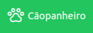
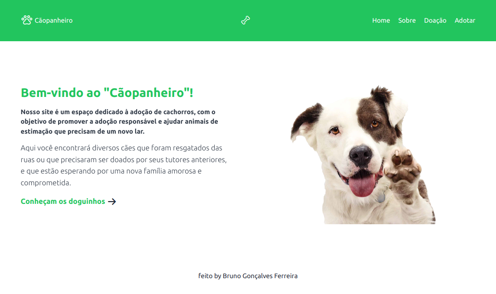

# Cãopanheiro



<hr>
<p align="center">
  <a href="#-sobre-o-projeto">Sobre o Projeto</a> ⚫ 
  <a href="#-layout">Layout</a> ⚫
  <a href="#-funcionalidades">Funcionalidades</a> ⚫
  <a href="#-como-rodar">Como Rodar</a> ⚫
  <a href="#-tecnologias">Tecnologias</a> ⚫
  <a href="#-autores">Autor</a>
</p>
<hr>

## 📽 Sobre o Projeto

Projeto para ajudar cãozinhos abandonados ou cãozinhos que estão sendo doados pelos seus donos.

## 🌄 Layout

<div>


</div>

## 🎬 Demonstração

- [Link demonstração]()

## 📱 Funcionalidades

- [x] Cadastramento de cães para doação
- [x] Lista de cães para doação
- [x] Bando de dados

## 💿 Como Rodar

Este projeto é divido em duas partes:

- Backend
- Frontend

Frontend precisa que o Backend esteja sendo executado para funcionar.

Pré-requisitos
Antes de começar, você vai precisar ter instalado em sua máquina as seguintes ferramentas: [Git](https://git-scm.com), [Node.js](https://nodejs.org/en/). Além disto é bom ter um editor para trabalhar com o código como [VSCode](https://code.visualstudio.com/).

Rodando o Frontend e o Backend (servidor)

```bash
# No terminal, clone o repositório
git clone https://github.com/brunogoncalvesferreira/adoption-dogs.git

# Acesse a pasta do projeto no terminal/cmd
cd adoption-dogs

# Instale as dependências
npm install

# Execute a aplicação
npm start

# O servidor iniciará na porta: 3000, acesse:
http://localhost:3000
```

## 👨‍💻 Tecnologias

Tecnologias usadas no projeto:


## 👨‍💻 Autores


Bruno Gonçalves Ferreira

<a href="https://www.linkedin.com/in/bruno-goncalves-ferreira/"></a>
<a href="mailto:brunogoncalvesferreira@outlook.com"></a>

<a href="https://www.instagram.com/brunogonferreira/"></a>
<a href="https://brunogoncalvesferreira.com"><a>
